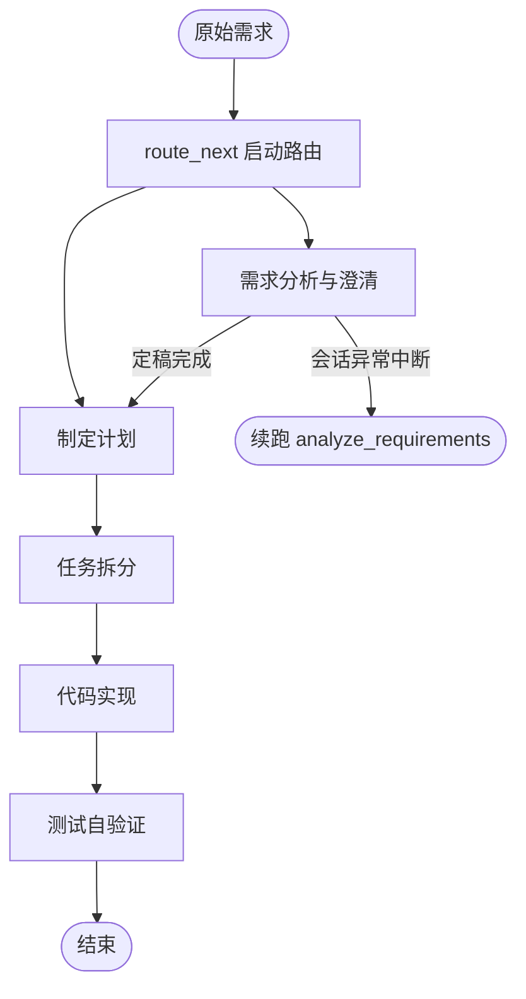

# Dev Workflow — 工程设计文档

从**原始需求**到**代码实现**再到**测试自验证**的工程化 Workflow 系统。

LangGraph 只负责 workflow 的编排（状态管理、节点调度）；每个节点是独立的 agent，通过 YAML 配置指定 AI 工具与 prompt，产出以 Markdown 写入 `docs/<需求名>/` 目录（每个需求独立子目录）。流程在 `src/workflow.py` 中固定定义。

---

## 1. 设计目标

| 目标 | 说明 |
|------|------|
| **流程标准化** | 将「需求 → 文档 → 计划 → 任务 → 代码 → 测试」固化为可重复执行的 pipeline |
| **职责分离** | LangGraph 管编排，节点管执行，AI 工具管调用，三者互不耦合 |
| **节点隔离** | 每个节点是独立 agent，不共享会话上下文，避免上下文污染 |
| **最小依赖** | 核心仅依赖 LangGraph + PyYAML，不引入 LLM SDK 作为硬依赖 |
| **可配置** | 节点工具、prompt、输入输出外置到 YAML；流程编排在代码中固定定义 |
| **可追溯** | 每个节点产出独立 Markdown 文件，便于审查、版本管理和人工介入 |

---

## 2. 设计原则

### 2.1 LangGraph 只做编排

LangGraph 在本系统中**不包含任何业务逻辑**，仅承担：

- **状态管理** — 在节点间传递 `requirement`、`test_passed` 等字段
- **节点调度** — 按固定顺序依次执行 5 个节点

节点的具体行为（读什么 prompt、调什么工具、写哪个文件）由 `NodeRunner` + YAML 配置驱动；节点顺序和边在 `src/workflow.py` 中写死。

### 2.2 节点即独立 Agent

每个节点在执行时：

1. 从 `prompts/` 加载 prompt 模板
2. 从 `docs/` 或 state 读取上游输入
3. 调用**当前节点配置的** AI 工具（Cursor / Claude Code / Echo）
4. 将结果写入 `docs/<需求名>/` 下对应的 Markdown 文件

各节点之间**不共享 AI 会话**。上游信息仅通过 Markdown 文档传递，保证每个 agent 的输入边界清晰、可审计。

### 2.3 流程固定，配置分离

- **流程编排**（节点顺序、边）写在 `src/workflow.py`，改流程直接改代码
- **节点执行配置**（工具、prompt、输入）写在 `config/workflow.yaml`

### 2.4 Workflow 级配置（`workflow.yaml` → `workflow`）

| 配置项 | 说明 | 默认值 |
|--------|------|--------|
| `docs_dir` | 产出根目录 | `docs` |
| `project_rules_dir` | 项目规则目录 | `project-rules` |
| `e2e.enabled` | 是否执行浏览器 E2E（Playwright MCP） | `true` |
| `e2e.base_url` | E2E 服务基址（host/端口） | `http://localhost:8080` |

关闭 E2E 示例：

```yaml
workflow:
  e2e:
    enabled: false
    base_url: http://localhost:8080
```

效果：

- `verify_tests` 仍执行 **单元测试 + API 测试**；`TC-E2E-*` 在报告中标记 **skip**（配置跳过，不算失败）
- 启动时**跳过** Playwright MCP 自动配置（与 `--skip-mcp-setup` 等效，仅针对 E2E）
- `verify_tests` prompt 通过 `{{e2e_enabled}}` / `{{e2e_base_url}}` 告知 Agent 当前配置

---

## 3. 整体架构

```
┌─────────────────────────────────────────────────────────┐
│                     LangGraph 编排层                      │
│  StateGraph → 固定线性调度                                │
└──────────────────────────┬──────────────────────────────┘
                           │
┌──────────────────────────▼──────────────────────────────┐
│                   NodeRunner 执行层                       │
│  加载配置 → 渲染 prompt → 调用工具 → 写入 docs/<需求名>/   │
└──────────────────────────┬──────────────────────────────┘
                           │
┌──────────────────────────▼──────────────────────────────┐
│                   AITool 适配层                           │
│  CursorTool │ ClaudeCodeTool │ EchoTool                  │
└─────────────────────────────────────────────────────────┘
```

### 三层职责

| 层级 | 模块 | 职责 |
|------|------|------|
| **编排层** | `src/workflow.py` | 固定定义 LangGraph 节点与边 |
| **执行层** | `src/nodes/node_runner.py` | 通用节点执行器，所有节点共用同一套逻辑 |
| **工具层** | `src/agents/` | AI 编程工具的适配器，统一 `run(prompt, cwd)` 接口 |

---

## 4. Workflow 流程



### 需求分析与澄清（单节点）

需求阶段合并为 **一个 interactive 节点 + 一个 prompt**（`prompts/01_requirements.md`）。在同一次 CLI 会话中完成：初稿 → **在初稿清单上与用户循环澄清** → 定稿。澄清回答直接更新 `01-requirements.draft.md` 顶部的 `clarification_checklist`，不单独输出澄清文档。

**续跑不依赖 AI 工具会话 ID**：上下文通过 Markdown 文件传递。若会话异常中断，再次执行 `./start.sh` 时会注入已有初稿/定稿，Agent 从断点继续。

每个产出 md 末尾由程序写入：

```markdown
## Workflow 状态

| 字段 | 值 |
|------|-----|
| node | analyze_requirements |
| status | completed |
| next_node | create_plan |
| phase | requirements |
| pending_count | 0 |
| all_resolved | true |
| updated_at | ... |
```

- **续跑**：同一 `--name` 再执行 `./start.sh`，读最新 md 的 `next_node`
- **重来**：`--fresh` 清除产出（保留 `00-requirement.md`）
- **跳过澄清**：`--skip-clarification`（初稿无 pending 时可直接提升为定稿）

### 各节点说明

| 节点 ID | 名称 | 默认工具 | 模式 | 产出 |
|---------|------|----------|------|------|
| `analyze_requirements` | 需求分析与澄清 | Cursor | **interactive** | `01-requirements.draft.md` → `01-requirements.md` |
| `create_plan` | 制定计划 | Cursor | **interactive** | `docs/<req>/02-plan.md` |
| `split_tasks` | 任务拆分 | Cursor | **interactive** | `docs/<req>/03-tasks.md` |
| `implement_code` | 代码实现 | Cursor | **interactive** | 代码变更 + `04-implementation.md` |
| `verify_tests` | 测试自验证 | Cursor | **interactive** | 按 `02-test-cases.md` 编写并执行单元/API/E2E 三层测试 + `05-test-report.md` |

所有节点均在 **交互式 CLI** 中执行（含需求定稿），产出文件写入后 workflow **自动退出 CLI 并进入下一阶段**。

不同节点可以使用不同的 AI 工具，在 `config/workflow.yaml` 的 `tool` 字段中独立配置。

---

## 5. 节点三要素设计

每个节点由以下三部分定义，全部外置在配置文件中：

```yaml
analyze_requirements:
  name: 需求分析与澄清
  tool: cursor
  mode: interactive
  prompt: prompts/01_requirements.md
  output: 01-requirements.md
  inputs:
    - state: requirement
    - doc: 01-requirements.draft.md
    - doc: 01-requirements.md
```

### 5.1 AI 工具（tool）

通过 `src/agents/registry.py` 注册，统一实现 `AITool` 接口：

```python
class AITool(ABC):
    def run(self, prompt: str, cwd: str) -> AIToolResult:
        """非交互（headless）执行"""

    def run_interactive(self, prompt: str, cwd: str) -> AIToolResult:
        """交互模式：继承终端，用户直接与 AI CLI 对话"""
```

| 工具 | 说明 | headless | interactive |
|------|------|----------|-------------|
| `cursor` | Cursor Agent | `agent -p --force --trust` | `agent --trust --force`（无 `-p`） |
| `claude_code` | Claude Code | `claude --print` | `claude`（无 `--print`） |
| `echo` | 调试模式 | 回显 prompt | 跳过交互会话 |

新增工具只需：实现 `AITool` → 注册到 `_TOOLS` 字典 → 在 yaml 中引用。

### 5.2 Prompt 模板（prompt）

存放在 `prompts/` 目录，使用 `{{变量名}}` 占位符，由 `NodeRunner` 渲染：

```markdown
## 原始需求
{{requirement}}

## 标准需求文档
{{doc_01-requirements.md}}
```

支持的变量来源：

- **state 变量** — 如 `{{requirement}}`、`{{project_root}}`
- **doc 变量** — 如 `{{doc_01-requirements.md}}`，自动读取 `docs/` 中对应文件内容

### 5.3 产出文档（output）

每个节点执行完成后，将结果写入 `docs/<需求名>/` 目录（按需求隔离）：

```text
docs/
└── jwt-login/                 # 需求目录（可由 --name 或文件名推导）
    ├── 00-requirement.md          # 原始需求输入
    ├── 01-requirements.draft.md   # 初稿 + 澄清清单（澄清回答在此更新）
    ├── 01-requirements.md         # 需求分析定稿
    ├── 02-plan.md
    ├── 03-tasks.md
    ├── 04-implementation.md
    └── 05-test-report.md
```

产出文档示例：

```markdown
# 需求分析与澄清

> 节点 ID: `analyze_requirements`
> AI 工具: `cursor`
> 生成时间: 2026-08-10T16:16:13
> 执行状态: 成功

---

（AI 工具返回的正文内容）
```

文档既是**人工可读的交付物**，也是**下游节点的输入源**，形成清晰的文档链。

### 5.4 需求分析结构化摘要

`analyze_requirements` 节点定稿产出（`01-requirements.md`）除 Markdown 正文外，必须在文档开头输出机器可读的 YAML 块：

```yaml requirement_metadata
requirement_type: new              # new | existing_change
requirement_summary: "一句话摘要"
judgment_basis: "判断依据"
change_scope: "变更范围"
affected_modules:
  - "模块A"
compatibility_risk: low            # low | medium | high
needs_clarification: false
open_questions_count: 0
```

定稿还需 `requirement_approval` 块，用户确认前为 `pending`，确认后为 `approved`；**仅 `approved` 时** workflow 才进入 `create_plan`：

```yaml requirement_approval
status: pending    # pending | approved
confirmed_at: ""
user_note: ""
```

节点执行后，`NodeRunner` 会解析该块并写入 LangGraph state：

| State 字段 | 说明 |
|------------|------|
| `requirement_type` | `new` 新需求 / `existing_change` 老需求调整 |
| `requirement_summary` | 需求摘要 |
| `change_scope` | 变更范围 |
| `affected_modules` | 受影响模块列表 |
| `compatibility_risk` | 兼容性风险等级 |
| `requirement_metadata` | 补充元数据（判断依据、待澄清等） |
| `requirement_approved` | 用户是否已确认定稿（来自 `requirement_approval.status`） |

下游节点（`create_plan`、`split_tasks`、`implement_code`）可通过 `inputs: state: requirement_type` 直接消费这些字段，无需再次解析 Markdown。

---

## 6. 状态管理

LangGraph 状态定义在 `src/state.py`：

```python
class DevWorkflowState(TypedDict, total=False):
    requirement: str          # 原始需求输入
    project_root: str         # 项目根目录
    docs_dir: str             # 产出目录
    current_node: str         # 当前执行的节点
    completed_nodes: list     # 已完成的节点列表（自动合并）
    node_outputs: dict        # 节点 ID → 产出文件路径（自动合并）
    test_passed: bool         # 测试是否通过（仅记录，不触发重试）
    last_error: str           # 最后一次错误信息
```

### 状态更新策略

- `completed_nodes` 和 `node_outputs` 使用 LangGraph 的 `Annotated` reducer，支持跨节点累积
- 其余字段由最新节点返回值覆盖
- LangGraph 自动持久化 checkpoint，支持 `langgraph dev` 调试

---

## 7. 数据流

```
用户输入 requirement
        │
        ▼
┌───────────────────────────────┐
│ 需求分析与澄清 (interactive)   │
│  初稿清单上循环澄清 → 定稿       │
│  产出: draft → 01-requirements.md │
└───────────────┬───────────────┘
                │ 读取定稿
                ▼
        ┌───────────────┐
        │  制定计划      │ ──► 02-plan.md
        │  (Cursor)     │
        └───────────────┘
                │
                ▼
        ... 依次传递 ...
                │
                ▼
        ┌───────────────┐
        │  测试自验证    │ ──► 05-test-report.md
        │  (Cursor)     │      严格按 02-test-cases 执行
        └───────────────┘      单元 + API + E2E；用项目既有测试栈
                               test_passed: ?
```

**关键设计**：节点间不传递 AI 会话历史，只传递 Markdown 文件。这使得：

- 每个 agent 的输入边界明确
- 任何节点可独立重跑（只需上游 docs 存在）
- 产出可直接提交 Git 做 Code Review

---

## 8. 目录结构

```
dev-workflow/
├── README.md                   # 本设计文档
├── pyproject.toml              # 依赖与包配置
├── langgraph.json              # LangGraph Dev 配置
├── run.py                      # CLI 入口
│
├── config/
│   └── workflow.yaml           # 节点配置（工具 / prompt / 输入 / 输出）
│
├── project-rules/              # 项目规则（各节点 extend_rules 引用）
│   └── ddd-design-standard.md
│
├── prompts/                    # 各节点 prompt 模板
│   ├── 01_requirements.md
│   ├── 02_create_plan.md
│   ├── 03_split_tasks.md
│   ├── 04_implement_code.md
│   └── 05_verify_tests.md
│
├── examples/                   # 示例需求与澄清回答
│
├── docs/                       # 按需求分子目录的节点产出（gitignore）
│   └── <requirement-slug>/
│       ├── 00-requirement.md
│       ├── 01-requirements.draft.md
│       ├── 01-requirements.md
│       ├── 02-plan.md
│       ├── 03-tasks.md
│       ├── 04-implementation.md
│       └── 05-test-report.md
│
└── src/
    ├── state.py                # LangGraph 状态定义
    ├── workflow.py             # 固定图编排
    ├── graph.py                # LangGraph Dev 导出
    ├── config_loader.py        # YAML 配置加载
    │
    ├── agents/                 # AI 工具适配层
    │   ├── base.py             # AITool 抽象接口
    │   ├── cursor_agent.py     # Cursor 适配器
    │   ├── claude_code_agent.py# Claude Code 适配器
    │   ├── echo_agent.py       # 调试适配器
    │   └── registry.py         # 工具注册表
    │
    └── nodes/
        └── node_runner.py      # 通用节点执行器
```

---

## 9. 快速开始

### 安装

```bash
cd dev-workflow
pip install -e .
```

### 调试模式（无需 AI 工具）

使用 `echo` 工具验证 workflow 编排是否正常：

```bash
python run.py "实现用户登录功能，支持 JWT 认证" --tool echo
```

执行后在 `docs/<需求名>/` 目录查看产出（含原始需求与各节点 Markdown）。

### 使用 Cursor

确保已安装 Cursor CLI，然后直接运行：

```bash
python run.py "实现用户登录功能，支持 JWT 认证"
```

### 使用 Claude Code

确保已安装 Claude Code CLI，然后在 `config/workflow.yaml` 中将对应节点的 `tool` 设为 `claude_code`。

### 从文件读取需求

```bash
python run.py --file ./my-requirement.md
```

### LangGraph Dev 调试

```bash
pip install langgraph-cli langgraph-api
langgraph dev
# 图 ID: dev_workflow
```

---

## 10. 扩展指南

### 新增节点

1. 在 `src/workflow.py` 添加节点函数、`add_node()` 和 `add_edge()`
2. 在 `config/workflow.yaml` 的 `nodes` 下添加执行配置
3. 在 `prompts/` 下创建 prompt 模板

### 新增 AI 工具

1. 在 `src/agents/` 下新建文件，继承 `AITool` 并实现 `run()` 方法
2. 在 `src/agents/registry.py` 的 `_TOOLS` 字典中注册
3. 在 yaml 中将节点的 `tool` 设为新工具名

### 调整流程

在 `src/workflow.py` 中修改节点函数和 `add_edge()`，例如新增节点、调整顺序。

### 自定义 prompt 变量

在 prompt 模板中使用 `{{变量名}}`，在 yaml 的 `inputs` 中声明数据来源（`state` 或 `doc`），`NodeRunner` 会自动渲染。

---

## 11. 依赖说明

| 包 | 用途 | 是否必须 |
|----|------|----------|
| `langgraph` | Workflow 编排 | 是 |
| `pyyaml` | 加载节点配置 | 是 |
| `python-dotenv` | 读取环境变量 | 是 |
| `typing-extensions` | TypedDict 兼容 | 是 |
| `langgraph-cli` | LangGraph Dev 调试 | 否 |

核心设计刻意不依赖 LangChain / OpenAI SDK，AI 能力完全通过外部工具（Cursor CLI、Claude Code CLI）提供。

---

## 12. 附属服务：JWT 登录认证

独立可运行的认证 HTTP 服务位于 [`auth-service/`](auth-service/)，与本仓库 LangGraph workflow（`src/`）解耦。启动、测试账号与联调说明见 [`auth-service/README.md`](auth-service/README.md)。
