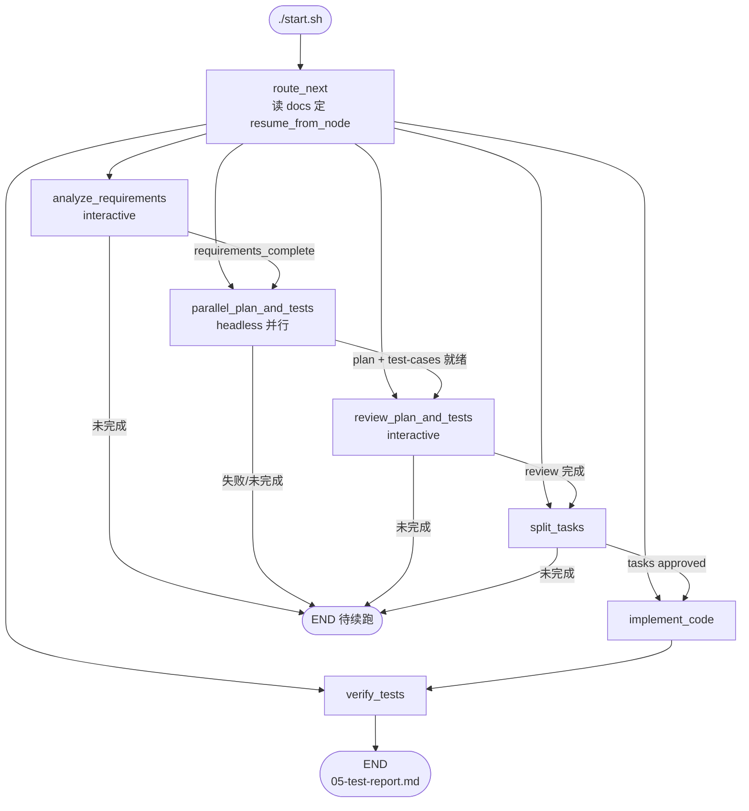

# Dev Workflow — 工程设计文档

从**原始需求**到**代码实现**再到**测试自验证**的工程化 Workflow 系统。

LangGraph 负责编排（状态管理、节点调度、续跑路由）；每个节点是独立 agent，通过 YAML 配置指定 AI 工具与 prompt，产出以 Markdown 写入 **应用项目根** 下的 `docs/<需求名>/`（默认 `dev-workflow/` 的上级目录）。流程拓扑在 `src/workflow.py` 中固定定义，节点行为在 `config/workflow.yaml` 中配置。

---

## 1. 设计目标

| 目标 | 说明 |
|------|------|
| **流程标准化** | 将「需求 → 计划/用例 → 评审 → 任务 → 代码 → 测试」固化为可重复 pipeline |
| **职责分离** | LangGraph 管编排，NodeRunner 管执行，AI 工具管调用 |
| **节点隔离** | 各节点不共享 AI 会话，仅通过 Markdown 传递上下文 |
| **最小依赖** | 核心依赖 LangGraph + PyYAML，LLM 能力由外部 CLI 提供 |
| **可配置** | 工具、prompt、项目规则外置 YAML；图结构在代码中固定 |
| **可追溯** | 每阶段独立 md + Workflow 状态表，支持续跑与 Code Review |

---

## 2. 设计原则

### 2.1 LangGraph 只做编排

- **状态管理** — 在节点间传递 `requirement`、`resume_from_node`、`test_passed` 等
- **节点调度** — 按固定图执行；阶段门禁（approval / content ready）决定是否进入下一节点
- **续跑路由** — 启动时读 `docs/` 已有产出，决定 `resume_from_node`（见 §4.3）

节点具体行为（prompt、工具、读写哪些 doc）由 `NodeRunner` + YAML 驱动。

### 2.2 节点即独立 Agent

1. 加载 `prompts/` 模板，注入 `{{ai_rules}}`、doc、state 变量
2. 调用节点配置的 AI 工具（`cursor` / `claude_code` / `oh_my_pi` / `echo`）
3. 将产出写入 **应用项目根** `docs/<需求名>/`（非 `dev-workflow/` 内）

**不共享 AI 会话**；上游信息仅通过 Markdown 与 state 字段传递。

### 2.3 流程固定，配置分离

| 层级 | 位置 | 内容 |
|------|------|------|
| 图编排 | `src/workflow.py` | 节点、边、并行 plan/test、门禁路由 |
| 节点执行 | `config/workflow.yaml` | tool、mode、prompt、inputs |
| 扩展规则 | `config/ai-rules.yaml` | 各节点 `extend_rules`（本地，不提交） |
| 规则内容 | `<app_root>/ai-rules/` | 规则 markdown 文件 |
| 续跑逻辑 | `src/router.py` | 读 docs 决定启动节点 |

### 2.4 Workflow 级配置

```yaml
workflow:
  app_root: ..              # 应用项目根（相对 dev-workflow/）
  docs_dir: docs            # 产出: <app_root>/docs/<需求名>/
  e2e:
    enabled: true          # false 时跳过浏览器 E2E
    base_url: http://localhost:8080
```

| 配置项 | 说明 | 默认 |
|--------|------|------|
| `app_root` | 应用项目根（业务代码 + docs 产出） | `..` |
| `docs_dir` | 产出相对 app_root 的子目录 | `docs` |
| `e2e.enabled` | 是否执行浏览器 E2E（Playwright MCP） | `true` |
| `e2e.headless` | E2E 是否无界面运行（`false`=弹出 Chrome） | `false` |
| `e2e.base_url` | E2E 服务基址（host/端口） | `http://localhost:8080` |

扩展规则（各项目不同）见 `config/ai-rules.yaml`（从 `ai-rules.example.yaml` 复制，**不提交仓库**）。

`e2e.enabled: false` 时：`verify_tests` 仍执行单元/API 测试；`TC-E2E-*` 在报告中标 **skip**（不算失败）；启动时跳过 Playwright MCP 同步。

---

## 3. 整体架构

```
┌─────────────────────────────────────────────────────────┐
│  LangGraph（workflow.py + router.py）                    │
│  route_next → 各阶段节点 → 门禁边 → END                  │
└──────────────────────────┬──────────────────────────────┘
                           │
┌──────────────────────────▼──────────────────────────────┐
│  NodeRunner（node_runner.py）                            │
│  渲染 prompt → 调用 AITool → 写 docs / 补 Workflow 状态   │
└──────────────────────────┬──────────────────────────────┘
                           │
┌──────────────────────────▼──────────────────────────────┐
│  AITool：cursor │ claude_code │ oh_my_pi (omp) │ echo       │
└─────────────────────────────────────────────────────────┘
```

业务代码、docs 产出与 **ai-rules** 均在 **应用项目根**（`workflow.app_root`）。`dev-workflow/` 仅保留编排配置与 prompts。

---

## 4. Workflow 流程

### 4.1 流程图



### 4.2 节点一览

| 节点 ID | 名称 | 模式 | 产出 | 说明 |
|---------|------|------|------|------|
| `analyze_requirements` | 需求分析与澄清 | **interactive** | `draft/01-requirements.draft.md` → `01-requirements.md` | 澄清清单 + 定稿 + `requirement_approval` |
| `parallel_plan_and_tests` | 并行计划与用例 | **headless** | `02-plan.md` + `02-test-cases.md` | 线程池并行跑 `create_plan`、`design_test_cases` |
| `review_plan_and_tests` | 计划与用例评审 | **interactive** | `02-plan-test-review.md` | 业务视角交叉比对，同步修订 plan/test |
| `split_tasks` | 任务拆分 | **interactive** | `03-tasks.md` | API 详细设计 + `tasks_approval`；**不注入** `02-test-cases.md` |
| `implement_code` | 代码实现 | **interactive** | 业务代码 + `04-implementation.md` | **只写生产代码**，不写测试；**不注入** `02-test-cases.md` |
| `verify_tests` | 测试自验证 | **interactive** | `src/test` 测试代码 + `05-test-report.md` | 严格按用例执行单元/API/E2E |

YAML 中还定义 `create_plan`、`design_test_cases` 两个 headless 子节点配置，由 `parallel_plan_and_tests` 内部调用，不单独出现在图上。

**interactive**：继承终端，用户与 Agent 对话；产出写入后 workflow 结束当前 CLI 会话，需再次 `./start.sh` 续跑下一阶段（或由单次 run 连续跑完所有已就绪门禁的节点——实际以 LangGraph 一次 invoke 为准，交互节点会在未过门禁时 END）。

**headless**：`agent -p` 非交互执行，写完整 md 到磁盘。

### 4.3 续跑与 CLI 选项

启动时 `determine_start_node()`（`src/router.py`）扫描 `docs/<name>/`：

1. 无 `03-tasks.md` 时，优先解析 plan/test/review 阶段（有 `02-plan`+`02-test-cases` → `review_plan_and_tests` 等）
2. 再按 checkpoint 链：`05` → `04` → `03` → `02-plan-test-review` → … → `01` → draft
3. 各阶段需过 **phase gate**（内容就绪 + 用户 `approved`），否则回到对应 interactive 节点

| 选项 | 说明 |
|------|------|
| `--name`, `-n` | 需求目录名，产出在 `<app_root>/docs/<name>/` |
| `--file`, `-f` | 从文件读需求（推荐） |
| `--skip-clarification` | 跳过需求/任务澄清 loop |
| `--fresh` | **清除**该目录下 md（保留 `00-requirement.md`）后重来；**与续跑互斥** |
| `--tool echo` | 调试编排，不调真实 AI |
| `--skip-mcp-setup` | 跳过 Playwright MCP 配置 |

```bash
# 首次运行（需求文件在应用根 docs/requirements/）
./start.sh --name product-list-toc --file ../docs/requirements/product-list-toc-requirement.md

# 续跑（不要加 --fresh）；已有 docs/<name>/ 时可只传 --name
./start.sh --skip-clarification --name product-list-toc
```

Windows（PowerShell / cmd，推荐 `start.cmd` 以免 ExecutionPolicy 拦截）：

```bat
cd dev-workflow
.\start.cmd --name product-list-toc --file ..\docs\requirements\product-list-toc-requirement.md
.\start.cmd --skip-clarification --name product-list-toc
```

每个产出 md 末尾由程序写入 **Workflow 状态** 表（`node`、`status`、`next_node`、`pending_count` 等），供人工查看；续跑以 **文件是否存在 + approval 块 + router 规则** 为准，不仅看 `next_node`。

---

## 5. 测试设计

### 5.1 分工

| 阶段 | 单元 `TC-UNIT-*` | API `TC-API-*` | E2E `TC-E2E-*` |
|------|------------------|----------------|----------------|
| `design_test_cases` | 写入 `02-test-cases.md` | 写入 `02-test-cases.md` | 不在此阶段设计 |
| `review_plan_and_tests` | 交叉核对并同步修订 | 交叉核对并同步修订 | 不在此阶段设计 |
| `split_tasks` | 不注入、不拆测试任务 | 不注入、不拆测试任务 | 不涉及 |
| `implement_code` | 不写、不注入用例全文 | 不写、不注入用例全文 | 不涉及 |
| `verify_tests` | 编写 + 运行 | 编写 + 运行 | 补充用例 + 执行（受 `e2e.enabled` 控制） |

- **用例注入**：`02-test-cases.md` 只进入 `review_plan_and_tests`、`verify_tests` 的 prompt（`workflow.yaml` `inputs`）；`split_tasks` / `implement_code` 不读该文件
- **唯一依据**：`verify_tests` 严格按 `02-test-cases.md`（及本节点补充的 E2E 用例）执行
- **框架**：必须使用业务工程已有测试栈（JUnit、MockMvc、`src/test`、Maven/Gradle），禁止自建独立测试工程
- **E2E**：仅 `verify_tests` prompt 描述；**必须**使用 Playwright MCP（`config/mcp/servers.json`）；截图写入 `docs/<req>/e2e-screenshots/`。**禁止** agent 在 MCP 失败时改用 Playwright CLI / 自建脚本；须告知用户 MCP 不可用并等待用户决策

### 5.2 开发阶段不涉及 E2E

计划、任务、实现、review 等 prompt **不描述** E2E 执行细节；E2E 配置与 MCP 说明仅在 `prompts/05_verify_tests.md`。

---

## 6. 扩展规则（ai-rules）

### 6.1 配置（本地，不提交）

与 `workflow.yaml` 同级，复制示例后按项目修改：

```bash
cp config/ai-rules.example.yaml config/ai-rules.yaml
```

```yaml
# config/ai-rules.yaml
ai_rules_dir: ai-rules   # 相对 app_root

nodes:
  analyze_requirements:
    - ddd-design-standard.md
  implement_code:
    - ddd-design-standard.md
  # ... 其他节点 node_id 与 workflow.yaml 一致
```

| 字段 | 说明 |
|------|------|
| `ai_rules_dir` | 规则 markdown 目录（相对 `app_root`） |
| `nodes.<node_id>` | 该节点注入的规则文件名列表 |

未配置 `ai-rules.yaml` 时，各节点 `{{ai_rules}}` 为空提示，workflow 仍可运行。

### 6.2 规则文件

`NodeRunner` 从 `<app_root>/<ai_rules_dir>/` 读取上述文件，拼入 prompt 的 `{{ai_rules}}`。规则内容归属应用项目，不放在 `dev-workflow/` 内。

---

## 7. 产出文档链

```text
<app_root>/                          # 应用项目（默认 = dev-workflow/..）
├── src/main/ ...                    # 业务代码
├── pom.xml
├── docs/
│   ├── requirements/                # 原始需求输入（示例与自定义）
│   │   ├── jwt-login-requirement.md
│   │   └── product-list-toc-requirement.md
│   └── <requirement-slug>/          # workflow 运行时产出
│       ├── 00-requirement.md
│       ├── draft/
│       ├── 01-requirements.md
│       ├── 02-plan.md
│       ├── 02-test-cases.md
│       ├── 02-plan-test-review.md
│       ├── 03-tasks.md
│       ├── 04-implementation.md
│       ├── 05-test-report.md
│       └── e2e-screenshots/
```

需求 slug：默认从 `--file` 文件名或 `--name` 推导（如 `docs/requirements/jwt-login-requirement.md` → `jwt-login`）。

### 需求定稿结构化块

`01-requirements.md` 头部需含：

```yaml requirement_metadata
requirement_type: new              # new | existing_change
requirement_summary: "..."
change_scope: "..."
affected_modules: [...]
compatibility_risk: low
```

```yaml requirement_approval
status: pending    # pending | approved — 仅 approved 且内容就绪后进入 parallel_plan_and_tests
```

后续阶段类似：`test_cases_approval`、`review_plan_tests_approval`、`tasks_approval` 等。

---

## 8. 节点配置三要素

```yaml
analyze_requirements:
  name: 需求分析与澄清
  tool: cursor
  mode: interactive          # interactive | headless
  prompt: prompts/01_requirements.md
  output: 01-requirements.md
  inputs:
    - state: requirement
    - doc: 01-requirements.draft.md
    - doc: 01-requirements.md
```

节点 `extend_rules` 在 `config/ai-rules.yaml` 中配置，不在 `workflow.yaml`。

### 8.1 AI 工具

| 工具 | headless | interactive |
|------|----------|-------------|
| `cursor` | `agent -p --force --trust` | `agent --trust --force` |
| `claude_code` | `claude --print --permission-mode bypassPermissions --dangerously-skip-permissions` | 同上（无 `--print`） |
| `oh_my_pi` / `omp` | `omp -p --auto-approve --no-session` | `omp --auto-approve` |
| `echo` | 回显 prompt（调试） | 跳过 |

`oh_my_pi` 即 [Oh My Pi](https://omp.sh/) 终端 Agent，CLI 命令为 `omp`。使用前需安装并登录（如 `omp auth-broker login` 或配置 `ANTHROPIC_API_KEY` 等 provider 环境变量）。

**Playwright MCP 与 omp 内置 browser 冲突**：omp 默认 `browser.enabled=true` 时会启用内置 Puppeteer browser，并**自动过滤** `.omp/mcp.json` 中的 `playwright` MCP（Cursor 无此行为）。`start.sh` 同步时会写入 **`.omp/config.yml`**（`browser.enabled: false`），omp 从项目根启动时会自动加载；workflow 启动 omp 时另注入 `config/omp-workflow.yaml` 作为双保险。若 `/mcp list` 只有 `pi-agent/browser` 而无 playwright，请重新 `./start.sh` 同步后**新开 omp 会话**（旧会话不会热加载配置）。omp 里 Playwright 工具名是 `mcp__playwright_browser_*`（如 `mcp__playwright_browser_navigate`），不是 Cursor 的裸名 `browser_*`；`/mcp list` 已 ready 时不要把 `browser_navigate` Unknown tool 当成 MCP 故障。

注册：`src/agents/registry.py`。

### 8.2 Prompt 变量

- **state**：`{{requirement}}`、`{{project_root}}`、`{{requirement_type}}` …
- **doc**：`{{doc_01-requirements.md}}` — 读取当前需求目录下对应文件（仅该节点 `inputs` 里列出的 doc 会注入）
- **ai_rules**：`{{ai_rules}}` — 来自 `config/ai-rules.yaml` + `<app_root>/ai-rules/`
- **verify 专用**：`{{e2e_enabled}}`、`{{e2e_headless}}`、`{{e2e_base_url}}`；`{{doc_02-test-cases.md}}` 仅在评审与 verify 节点注入

---

## 9. 状态管理

`src/state.py` 中 `DevWorkflowState` 主要字段：

| 字段 | 说明 |
|------|------|
| `requirement` / `docs_dir` / `requirement_slug` | 输入与产出路径 |
| `resume_from_node` | 启动时由 router 设置，只用于 `route_next` |
| `requirement_type` … `requirement_metadata` | 需求分析结构化结果 |
| `requirement_approved` … `tasks_approved` | 各阶段用户确认 |
| `clarification_*` | 澄清清单状态 |
| `skip_clarification` | CLI `--skip-clarification` |
| `node_outputs` / `completed_nodes` | 累积型 reducer |
| `test_passed` | 由 `05-test-report.md` 解析 |

---

## 10. 目录结构

```text
dev-workflow/
├── README.md
├── start.sh                    # macOS / Linux 入口（venv + run.py）
├── start.ps1 / start.cmd       # Windows 入口（cmd 包装 PowerShell）
├── run.py
├── pyproject.toml
├── langgraph.json
│
├── config/
│   ├── workflow.yaml
│   ├── ai-rules.example.yaml   # 扩展规则示例（复制为 ai-rules.yaml）
│   └── mcp/
│       └── servers.json        # Playwright MCP（E2E）
│
├── prompts/
│   └── ...
│
└── src/
```

应用项目根（默认 `dev-workflow/..`）：

```text
<app_root>/
├── ai-rules/                   # 扩展规则（如 ddd-design-standard.md）
├── docs/
│   ├── requirements/           # 原始需求输入
│   └── <requirement-slug>/     # workflow 运行时产出
└── src/main/ ...
```

`dev-workflow/` 内**不再**包含 `docs/` 或 `ai-rules/`（均在应用项目根）。

---

## 11. 快速开始

### 安装与启动

```bash
cd dev-workflow
cp config/ai-rules.example.yaml config/ai-rules.yaml   # 首次使用
./start.sh --help

# 调试编排（echo，跳过澄清）
./start.sh --tool echo --skip-clarification --file ../docs/requirements/jwt-login-requirement.md

# 正式跑（Cursor + 指定需求名）
./start.sh --name jwt-login --file ../docs/requirements/jwt-login-requirement.md
```

Windows：

```bat
cd dev-workflow
copy config\ai-rules.example.yaml config\ai-rules.yaml
.\start.cmd --help
.\start.cmd --tool echo --skip-clarification --file ..\docs\requirements\jwt-login-requirement.md
.\start.cmd --name jwt-login --file ..\docs\requirements\jwt-login-requirement.md
```

需已安装 Python 3.10+（`python` / `py -3`）和 Node 18+（或 nvm-windows）。交互节点依赖本机已登录的 Cursor / Claude / omp CLI。

### 常用命令

```bash
# 仅安装依赖
pip install -e .

# 直接调用 run.py
python run.py --file ../docs/requirements/product-list-toc-requirement.md --name product-list-toc

# LangGraph Dev
pip install langgraph-cli langgraph-api
langgraph dev   # 图 ID: dev_workflow
```

### MCP / E2E

- Node 18+；`start.sh` 会尝试 nvm 切换版本，Windows `start.ps1` 会尝试 nvm-windows
- E2E 开启时自动同步 MCP 到 Cursor / Claude / Codex / **Oh My Pi**（`.omp/mcp.json` + `.omp/config.yml`），除非 `--skip-mcp-setup` 或 `e2e.enabled: false`；Windows 同步 Playwright wrapper 为 `scripts/playwright-mcp.cmd`
- Playwright MCP 使用 `@playwright/mcp@0.0.79` + `--browser chrome`（优先系统 Google Chrome）；`workflow.e2e.headless: false`（默认）时不传 `--headless`，E2E 会弹出 Chrome 窗口；设为 `true` 则后台 headless 运行
- **勿用** `--browser chromium`（旧配置会触发 `chrome-for-testing` revision 不匹配）；若 Cursor/omp 报 browser 未安装，重新 `./start.sh` 同步 MCP 后**重启 IDE/omp 会话**使 MCP 配置生效
- 页面 path 由实现代码/报告确认；host/端口来自 `workflow.e2e.base_url`

---

## 12. 扩展指南

### 新增节点

1. `src/workflow.py` — 节点函数、`add_node`、条件边
2. `src/router.py` — `ROUTABLE_NODES`、checkpoint、gate（若需续跑）
3. `src/phase_gate.py` — `PHASE_CONFIGS`（若有 approval）
4. `config/workflow.yaml` + `prompts/` 新模板

### 新增 AI 工具

实现 `AITool` → 注册 `src/agents/registry.py` → yaml 中 `tool:` 引用。

### 新增项目规则

在 `<app_root>/ai-rules/` 添加 md，在 `config/ai-rules.yaml` 对应节点的列表中引用。

### 调整流程

修改 `src/workflow.py` 中的边与门禁函数；YAML  alone 无法改拓扑。

---

## 13. 依赖

| 包 | 用途 |
|----|------|
| `langgraph` | Workflow 编排 |
| `pyyaml` | 配置加载 |
| `python-dotenv` | 环境变量 |
| `typing-extensions` | TypedDict |

不依赖 LangChain / OpenAI SDK；AI 能力由 Cursor CLI、Claude Code CLI 等外部工具提供。

---

## 14. 与业务仓库的关系

| 路径 | 内容 |
|------|------|
| `dev-workflow/` | LangGraph 编排、YAML 配置、prompts |
| `<app_root>/` | 业务代码、`ai-rules/`、`docs/` |

`workflow.app_root` 可在 `config/workflow.yaml` 中改为绝对路径或其它相对路径。
