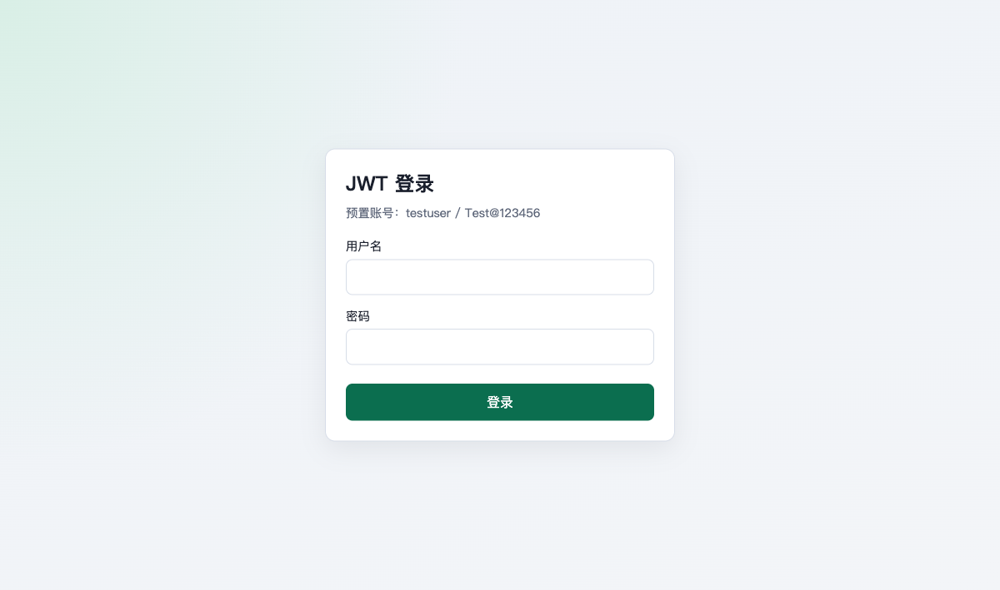
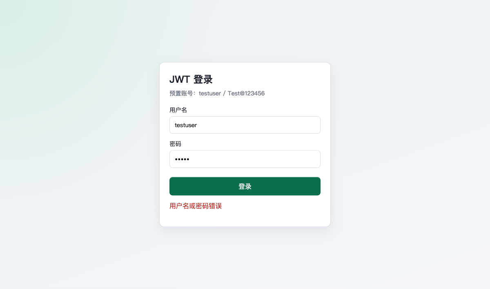
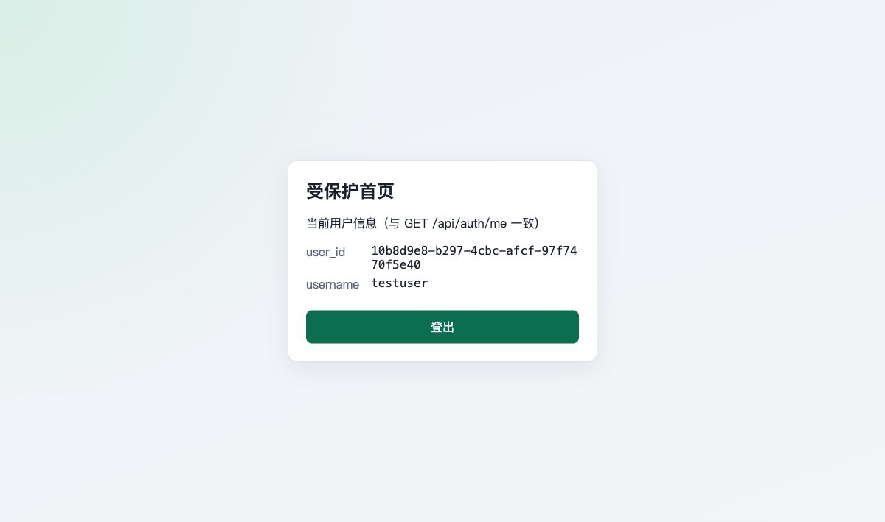

# 测试报告：用户 JWT 登录认证

> 节点 ID: `verify_tests`  
> 执行时间: 2026-08-16T15:15:00+08:00 ~ 2026-08-16T15:16:10+08:00  
> 工程根: `/Users/feiwang/Documents/interview/ai-workflow-verification`（非 `dev-workflow/`）  
> 基址: `http://localhost:8080`

---

## 测试结论

**test_passed: true**

单元/集成测试 15/15 通过；API 冒烟与 Playwright MCP 浏览器 E2E（登录 → 用户信息 → 登出 → 再访受保护页）全部通过。预置账号口径为 `testuser` / `Test@123456`，`data/users.json` 无明文密码。

---

## 1. 执行过的命令

| # | 命令 | 结果 |
|---|------|------|
| 1 | `cd <repo-root> && mvn test` | **BUILD SUCCESS**；Tests run: **15**，Failures: 0，Errors: 0 |
| 2 | `mvn spring-boot:run -q` | Tomcat started on port **8080** |
| 3 | `curl` 冒烟：`GET /login`、`POST /api/auth/login`、`GET /api/auth/me`、错误密码、无令牌 me、`POST /api/auth/logout` | 均符合契约 |
| 4 | Playwright MCP：`browser_navigate` / `browser_fill_form` / `browser_click` / `browser_snapshot` / `browser_take_screenshot` / `browser_evaluate` | E2E 全流程通过并落盘截图 |

---

## 2. 单元 / 集成测试用例及结果

### 2.1 领域单测 — `CredentialDomainServiceTest`（5）

| 用例 | 覆盖 DoD / 验收 | 结果 |
|------|-----------------|------|
| `authenticateSucceedsWithValidCredentials` | 成功认证 | ✅ PASS |
| `authenticateFailsWithWrongPasswordUsingUniformException` | 错误密码 → InvalidCredentials，不暴露用户是否存在 | ✅ PASS |
| `authenticateFailsForUnknownUserUsingUniformException` | 未知用户统一异常语义 | ✅ PASS |
| `userRejectsBlankPasswordHash` | 聚合不变量 | ✅ PASS |
| `userIdGenerateProducesUuidString` | UserId 值对象 | ✅ PASS |

### 2.2 API 集成测试 — `AuthApiIntegrationTest`（10）

| 用例 | 覆盖验收 / 契约 | 结果 |
|------|-----------------|------|
| `loginSucceedsWithPresetAccount` | 正确登录返回 `access_token` / `token_type=Bearer` / `expires_in=7200` | ✅ PASS |
| `loginFailsWithWrongPassword` | 401 + `invalid_credentials` +「用户名或密码错误」，无 token | ✅ PASS |
| `loginFailsWithBlankFields` | 400 + `bad_request` | ✅ PASS |
| `meSucceedsWithValidToken` | 有效 token → `user_id` + `username=testuser` | ✅ PASS |
| `meFailsWithoutToken` | 缺令牌 → 401 `unauthorized` | ✅ PASS |
| `meFailsWithMalformedToken` | 非法令牌 → 401 | ✅ PASS |
| `meFailsWithExpiredToken` | 过期令牌 → 401 | ✅ PASS |
| `logoutRequiresValidTokenAndSucceeds` | 200 + `message=logged_out` | ✅ PASS |
| `logoutFailsWithoutToken` | 登出缺令牌 → 401 | ✅ PASS |
| `jwtPayloadContainsRequiredClaims` | payload 含 sub、username、iat、exp；TTL≈7200s | ✅ PASS |
| `@BeforeEach` 文件断言 | users 文件含 `testuser`、不含明文 `Test@123456` | ✅ PASS |

---

## 3. API 手动冒烟（运行中服务）

| 场景 | 实际结果 | 判定 |
|------|----------|------|
| `GET /login` | HTTP 200 | ✅ |
| `POST /api/auth/login`（testuser / Test@123456） | 200；`access_token`、`token_type=Bearer`、`expires_in=7200`（snake_case） | ✅ |
| `GET /api/auth/me` + Bearer | 200；`user_id`、`username=testuser` | ✅ |
| 错误密码登录 | 401；`error=invalid_credentials`；`message=用户名或密码错误` | ✅ |
| 无 token 访问 me | 401；`error=unauthorized`；`message=未认证或令牌无效` | ✅ |
| `POST /api/auth/logout` + Bearer | 200；`message=logged_out` | ✅ |
| `data/users.json` | 仅 bcrypt `passwordHash`；无明文密码 / 无 admin | ✅ |

---

## 4. E2E 浏览器验收（Playwright MCP）

前置：服务已在 `http://localhost:8080` 启动。截图目录：`e2e-screenshots/`（相对本报告）。

| 步骤 | 操作 | 断言 | 结果 | 截图 |
|------|------|------|------|------|
| 1 | 打开 `http://localhost:8080/login` | 标题「JWT 登录」；提示预置账号 `testuser / Test@123456`；可见用户名/密码/登录 | ✅ | 见下 |
| 2 | 输入 `testuser` / `wrong` 并登录 | 仍停留 `/login`；显示「用户名或密码错误」 | ✅ | 见下 |
| 3 | 输入 `testuser` / `Test@123456` 并登录 | 跳转 `http://localhost:8080/`；`localStorage.access_token` 有值 | ✅ | 见下 |
| 4 | 查看受保护首页 | 展示 `user_id=10b8d9e8-…`、`username=testuser`（与 `/api/auth/me` 一致） | ✅ | 见下 |
| 5 | 点击「登出」 | 回到 `/login`；`localStorage.access_token` 为 `null` | ✅ | 见下 |
| 6 | 再访 `http://localhost:8080/` | 前端门禁重定向至 `/login` | ✅ | 见下 |

### 4.1 登录页

### 4.2 错误密码

### 4.3 登录成功（受保护首页）

### 4.4 用户信息展示

### 4.5 登出后

### 4.6 再访首页被引导回登录

---

## 5. DDD 架构抽检（对照 extend_rules）

| 自检项 | 结果 |
|--------|------|
| 四层包结构 domain / application / interfaces / infrastructure | ✅ |
| `domain` 无 Spring/JPA/Servlet/jjwt outward 依赖 | ✅（grep 无违规 import） |
| Repository / PasswordHasher / TokenProvider Port 在 domain，实现在 infrastructure | ✅ |
| Controller 仅调用 ApplicationService（无 Repository） | ✅ |
| 应用层不 import infrastructure 具体类 | ✅ |
| 凭证规则在 `CredentialDomainService` / `User.matchesPassword` | ✅ |
| 入站 Filter 在 infrastructure | ✅ |

---

## 6. 发现的问题与修复建议

| 级别 | 问题 | 建议 |
|------|------|------|
| 低（非阻塞） | TASK-02 约定 jjwt **HS256**，当前 `JwtTokenProvider.signWith(secretKey)` 由密钥长度自动选型；本地 secret≈51 字节时实际签发 **HS384**（header `alg=HS384`）。功能与验签正常，与文档字面略有偏差。 | 显式指定算法，例如 `signWith(secretKey, Jwts.SIG.HS256)`，并保证密钥长度满足所选算法；或在 README 写明「按密钥长度自动选择 HMAC」。 |
| 低（已知限制） | 登出无服务端黑名单；未过期 access_token 在 API 侧仍可能有效。 | 已在 README / 任务说明中声明；本期验收以客户端清除 localStorage 为准，无需改代码。 |
| 信息 | `AuthController.extractBearerToken` 直接抛出 domain 的 `UnauthorizedException`（接口层引用领域异常类型）。 | 可接受的薄适配；若追求更严分层，可将「缺 Bearer」委托给 ApplicationService 或 Filter，使 Controller 零 domain import。 |

以上均**不阻碍**本期验收通过。

---

## 7. 验收对照汇总

| 需求验收项（摘要） | 验证方式 | 结果 |
|--------------------|----------|------|
| 正确登录返回三要素 | 集成测试 + curl | ✅ |
| 错误密码 401、无 token、统一文案 | 集成测试 + E2E | ✅ |
| 有效 token 访问 me | 集成测试 + curl + E2E | ✅ |
| 缺/非法/过期 token → 401 | 集成测试 + curl | ✅ |
| JWT claims：sub/username/iat/exp；过期策略 | 集成测试 | ✅ |
| users 文件无明文密码 | 集成 BeforeEach + 文件检查 | ✅ |
| 页面：登录 → 看 me → 登出 → 再访需登录 | Playwright E2E + 截图 | ✅ |
| 账号口径 testuser / Test@123456 | 全链路 | ✅ |

---

**test_passed: true**

## Workflow 状态

| 字段 | 值 |
|------|-----|
| node | verify_tests |
| status | completed |
| next_node |  |
| phase | verify |
| pending_count | 0 |
| all_resolved | true |
| updated_at | 2026-08-16T15:16:32 |
